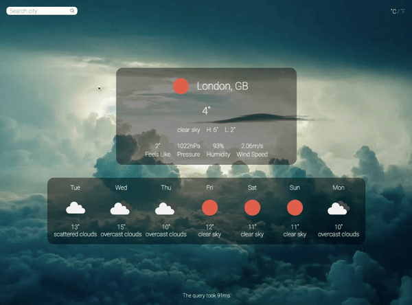

# Weather App
> A web weather app built using HTML, CSS, and vanilla JavaScript where the data is fetched from OpenWeather API. Live demo [here](https://yamakenth.github.io/weather-app/).
## Screen Capture

## Features
- Allows users to input a desired city name to fetch weather data 
- Displays current weather and daily forecasts for the next 7 days
- Allows users to toggle between metric and imperial units
- Shows query time of each request and a loading message when there is a delay in fetching
- Presents users with an error message when a city name was not found
## Technologies Used
- HTML
- CSS
- JavaScript
- Webpack